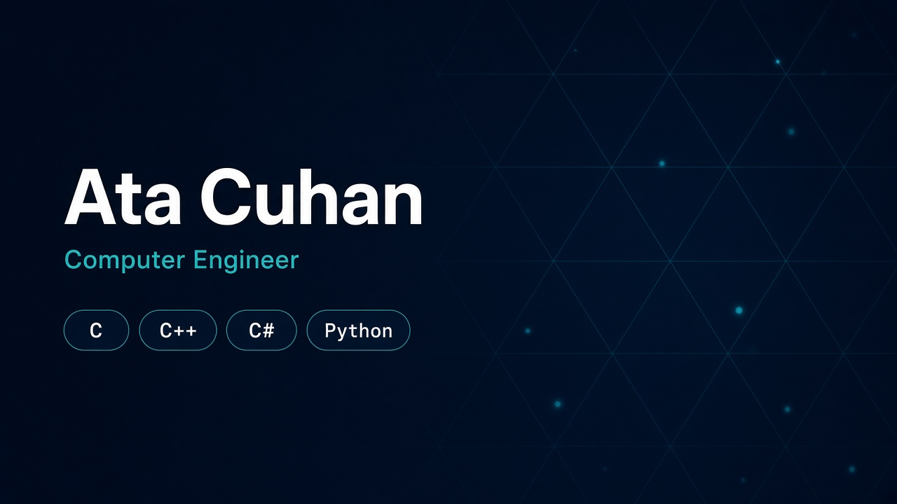

Computer engineer. The public repositories here are coursework from METU NCC.

  
  
  
  

## Projects

| | |
| --- | --- |
| [basicbanking](https://github.com/atacuhan1/basicbanking) | Console banking system in C |
| [shoppingcentre](https://github.com/atacuhan1/shoppingcentre) | Shopping-centre manager in C++ |
| [battleshipgame](https://github.com/atacuhan1/battleshipgame) | Two-player fleet battle in C++ |
| [CragGame](https://github.com/atacuhan1/CragGame) | Dice game in C |
| [DFAandNFA](https://github.com/atacuhan1/DFAandNFA) | DFA and NFA simulator in Python |
| [One_toFourDemultiplexer](https://github.com/atacuhan1/One_toFourDemultiplexer) | 1-to-4 demultiplexer in C |
